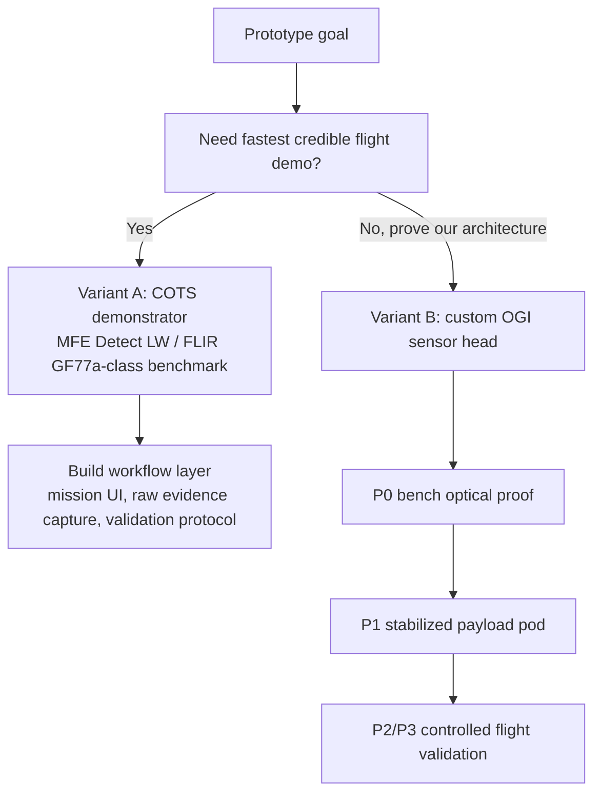
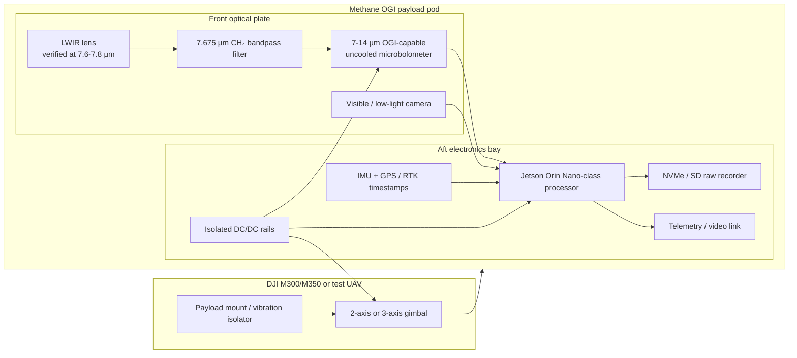
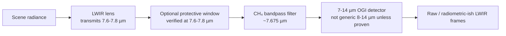
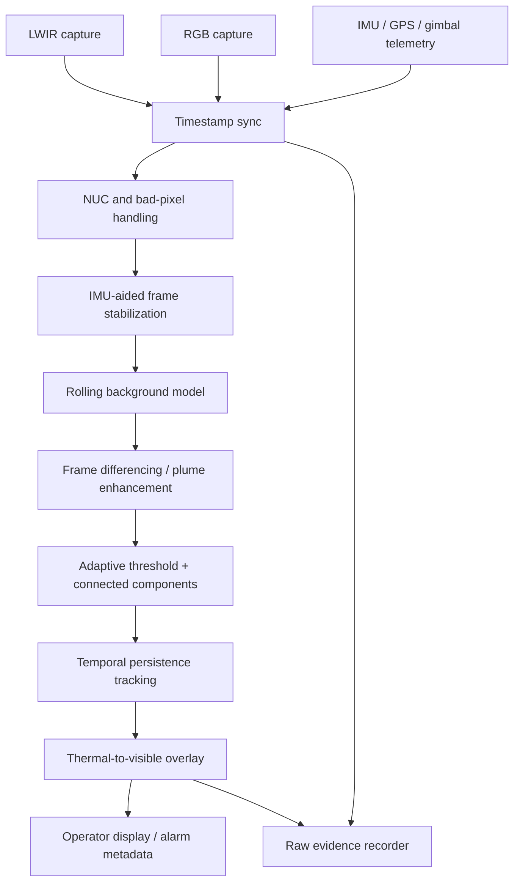
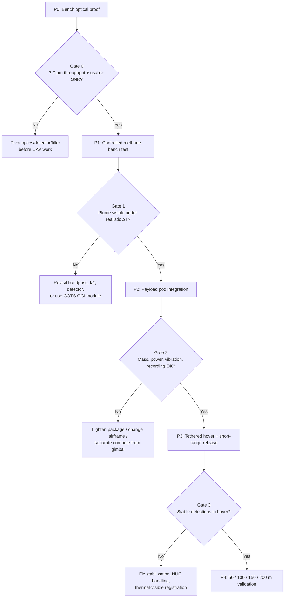

# Prototype Architecture — Small-UAV Methane OGI Payload

*Companion prototype document for `methane-ogi-payload-report.md`. This document does not change the report's recommendation; it turns the described architecture into a buildable prototype shape, with GitHub-renderable Mermaid diagrams.*

## Executive Summary

The prototype should be built as an **instrumented methane-OGI validation rig first, UAV payload second**. The core design correction from the follow-up research is that the custom prototype should **not** be based on a generic 8-14 µm thermal core unless the vendor proves usable response at 7.6-7.8 µm. The methane LWIR band of interest sits near 7.7 µm, so the sensor path must be specified as **7-14 µm / 7-8.5 µm OGI-capable**, not merely "LWIR".

Recommended prototype strategy:

1. **Benchmark path:** use or rent a COTS methane OGI reference such as **MFE Detect LW** or **FLIR GF77/GF77a** to establish what real uncooled-LWIR methane imagery looks like.
2. **Custom path:** build a bench prototype around a **7-14 µm OGI-capable uncooled microbolometer** plus a **7.675 µm CH₄ bandpass filter**, then package it into a stabilized UAV pod only after plume visibility is proven.

## Source-Grounded Anchors

| Anchor | What it validates | Source |
|---|---|---|
| MFE Detect LW | Drone-native uncooled LWIR methane OGI payload for DJI M300/M350, 640×480 imagery, Appendix K / OOOOa/b/c claims | <https://mfe-is.com/product/mfe-detect-lw/> |
| FLIR GF77 / GF77a | Uncooled methane OGI at 7-8.5 µm using an uncooled microbolometer; CH₄ NECL claim at 1 m / ΔT 10 °C | <https://www.flir.com/products/gf77a/> |
| Lynred PICO640S BB 7-14 | 640×480, 17 µm, **7-14 µm** uncooled microbolometer intended for OGI / LDAR and CH₄ detection | <https://www.lynred.com/products/pico640s-bb-7-14> |
| Spectrogon BP-7675-240 nm | Commercial CH₄ IR bandpass filter centered at 7675 nm | <https://www.spectrogon.com/products/ir-filters-for-gas-analysis-2/> |
| DJI Matrice 350 RTK | UAV integration constraint: single gimbal damper max payload 960 g; third-party payloads through Payload SDK | <https://enterprise.dji.com/matrice-350-rtk/specs> |

## Prototype Variants

### Variant A — COTS Demonstrator

Use **MFE Detect LW** on a DJI M300/M350-class airframe and focus our work on operator workflow, data capture, mission procedure, and validation data.

Best when the goal is to show a methane plume from a UAV quickly and credibly.

### Variant B — Custom Sensor-Head Prototype

Build our own methane OGI head using an OGI-capable broadband detector and methane filter. This is the path that most closely matches the report's architecture.

Best when the goal is to prove the design and own the sensor/software stack.



## Physical Prototype Layout

The custom prototype should be a compact under-slung pod with a rigid optical plate, one methane-filtered LWIR aperture, one visible context camera, aft-mounted compute, and service access for the filter/lens stack.



### Front Face Sketch

```text
┌──────────────────────────────────────────┐
│ Methane OGI payload front plate           │
│                                          │
│   ○ Visible camera                        │
│                                          │
│        ● LWIR methane aperture            │
│          lens → CH₄ filter → detector     │
└──────────────────────────────────────────┘
```

## Optical Stack

The procurement requirement is stricter than "LWIR camera". Every element in the optical path must be verified at the methane band.



### Gate 0 Procurement Rule

Do not buy the thermal core until the vendor confirms all of the following:

- detector response includes **7.6-7.8 µm**;
- detector package window does not block the methane band;
- selected lens transmits at **7.6-7.8 µm**;
- any protective window transmits at **7.6-7.8 µm**;
- raw or minimally processed frame access is available;
- filter angle-of-incidence shift is acceptable at the chosen f-number.

## Data and Software Architecture

The first software deliverable is not a polished ML detector; it is a replayable data pipeline that records synchronized evidence and supports offline tuning.



Minimum viable software modules:

| Module | Purpose |
|---|---|
| `lwir_capture` | Ingest raw or radiometric-ish LWIR frames |
| `rgb_capture` | Ingest visible context frames |
| `timestamp_sync` | Align LWIR, RGB, IMU, GPS, gimbal telemetry |
| `nuc_event_handler` | Track NUC events and suppress false alarms during recovery |
| `background_model` | Rolling temporal background for plume contrast |
| `plume_candidates` | Thresholding, morphology, connected components |
| `persistence_tracker` | Reject one-frame noise and static hot objects |
| `overlay_renderer` | Project plume masks onto visible context frame |
| `recorder` | Save replayable raw data + processed overlay + metadata |

## Build Phases and Gates



### Phase Detail

| Phase | Build | Pass criteria |
|---|---|---|
| P0 | Optical bench: detector + lens + CH₄ filter + recorder | Measured signal at 7.7 µm; acceptable noise after narrowband filter |
| P1 | Controlled methane release with thermal background | Plume visible in recorded LWIR frames under realistic ΔT |
| P2 | Enclosed pod with visible camera, Jetson, IMU, storage, power | Sustains 25-30 Hz recording; no thermal throttling; stable timestamps |
| P3 | Tethered hover / short-range release | Overlay works during vibration and gimbal motion; no frame-loss pathologies |
| P4 | Controlled flight range campaign | Empirical operating envelope at 50-200 m; false-positive cases documented |

## SWaP Targets

| Prototype stage | Mass target | Notes |
|---|---:|---|
| P0 bench | unconstrained | Prove optics before miniaturizing |
| P1 engineering pod | 0.9-1.5 kg | Acceptable for test airframe; may exceed DJI single-gimbal target |
| DJI single-gimbal goal | <960 g | Matrice 350 single gimbal damper constraint |
| Power target | 10-20 W | Depends on Jetson mode, radio, gimbal, and sensor electronics |

If the first engineering pod cannot fit under 960 g, use one of these mitigations:

1. fly on a larger test airframe;
2. use a fixed vibration-isolated mount for P3;
3. separate compute from the gimbaled optical head;
4. switch to a COTS DJI-native payload for flight demonstration.

## Why Generic 8-14 µm Cores Are Not the Baseline

Generic 8-14 µm cores are useful only for payload plumbing tests: capture, synchronization, Jetson processing, overlay, and radio. They are **not** the methane prototype baseline because the CH₄ band is near 7.7 µm and may be cut off by:

- detector package windows;
- lens coatings;
- internal long-pass filters;
- protective windows;
- vendor image processing that hides raw contrast.

The custom methane prototype should therefore be specified as:

> **7-14 µm / 7-8.5 µm OGI-capable uncooled detector path with verified 7.6-7.8 µm throughput.**

## Recommended Baseline Build

**Best custom baseline:**

```text
7-14 µm OGI-capable uncooled microbolometer
  + 7.675 µm CH₄ bandpass filter
  + LWIR lens verified at 7.6-7.8 µm
  + boresighted visible camera
  + Jetson Orin Nano-class recorder/processor
  + IMU/GPS/gimbal telemetry
  + vibration-isolated pod
```

**Best practical workflow:**

1. Benchmark against MFE Detect LW or FLIR GF77/GF77a if available.
2. Build P0 bench optical head.
3. Run controlled methane release tests.
4. Only then design the flight pod.
5. Treat 50-200 m performance as a validation result, not a procurement assumption.
