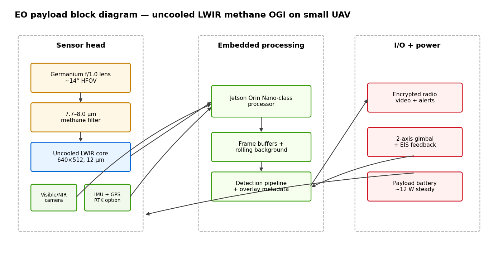
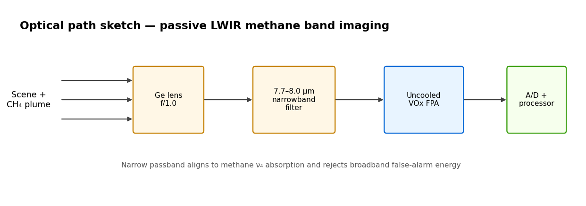
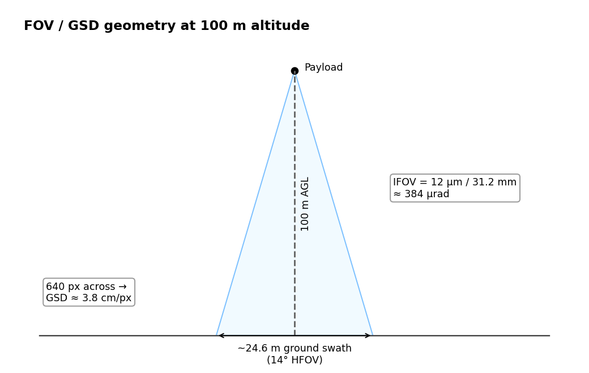
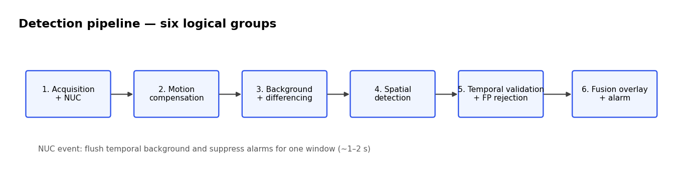
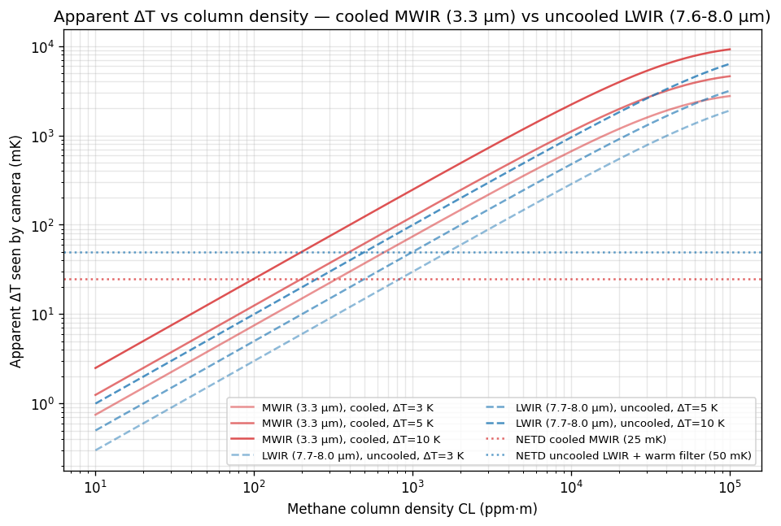

# An EO Payload for Methane Optical Gas Imaging on Small UAVs

## §1 — Executive Summary

This report defends a **small-UAV electro-optical payload built around an uncooled long-wave infrared (LWIR) detector with a 7.7-8.0 µm narrowband methane filter** for visualization-grade optical gas imaging (OGI) at 50-200 m operating altitude. The textbook answer — cooled mid-wave infrared (MWIR) at the 3.3 µm methane band — is the wrong one for this mission. Cryocooled MWIR carries an order-of-magnitude mass / cost penalty, 3-6 min cool-down per survey, and a Stirling-cooler bearing-wear failure mode that degrades on a vibrating airframe. Uncooled LWIR with a narrowband methane filter loses ~5× on raw column-density sensitivity at 5 K thermal differential (~200 ppm·m cooled MWIR vs ~1100 ppm·m uncooled LWIR, atmospheric loss folded in) but wins on every operational dimension for dispersed-asset survey: SWaP, cost, instant-on, cryocooler-MTBF risk, solar-contamination resistance, deployable integration. Architecture is commercially validated (FLIR GF77/GF77a handheld; MFE Detect LW for DJI M300/M350); the 50-200 m range envelope is modeled in §8, not field-validated.

**Cooled MWIR remains the right choice** when (a) the platform is fixed and SWaP is unconstrained, (b) the mission requires regulatory-grade low-emission-rate quantification, (c) plumes are very thin and near the detection floor, (d) backgrounds are cold and ΔT is marginal, or (e) cool-down time, cryocooler MTBF, and per-unit cost are not deciding constraints. **Operating envelope** (per §8): 50-150 m nominal at ΔT ≥ 5 K (~1100-1200 ppm·m floor); 200 m marginal under favorable conditions (~1380 ppm·m). The system is **survey-grade** — sized for compact high-emission / superemitter plumes in a heavy-tailed emissions landscape, not regulatory quantification at every leak. The integrated payload spans the LWIR detector + narrowband filter, germanium optics, 2-axis IMU-stabilized gimbal, co-boresighted visible-fusion camera, Jetson Orin Nano-class processor, encrypted radio link, and isolated payload power. Companion `bonus/` Python simulation generates the §4/§8 sensitivity plots and runs the detection-pipeline demo. Appendices E/F/G (low-level platforms, verification plan, diagnostics — separate supporting documents) cover the system-engineering layer.

---

## §2 — Mission and Requirements

### 2.1 — Why methane, why now

Methane has a 20-year fossil-methane GWP of ~82× CO₂ per IPCC AR6 (the older 84× shorthand traces to AR5-with-feedback). U.S. oil-and-gas methane emissions are heavy-tailed: a small fraction of high-emitting sites contributes a large share of basin emissions, which makes *finding the right leaks fast* more valuable than quantifying every fugitive leak. EPA NSPS subparts OOOOa/b/c set LDAR obligations for covered oil-and-gas facilities; OGI is an approved method when the equipment meets **40 CFR Part 60 Appendix K** §6.1.2:

> The OGI camera must be capable of detecting (or producing a detectable image of) methane emissions of **19 grams per hour (g/hr)** […] at a viewing distance of **2.0 meters** and a delta-T of **5.0 °C** in an environment of calm wind conditions around 1 meter per second (m/s) or less.

At 50-200 m UAV standoff — far beyond the 2 m benchmark — sensitivity degrades along an empirical power law in distance (Ravikumar et al. *ES&T* 52(4), 2018: median 50% detection limit ~20 g/hr at 6 m, an order of magnitude worse than vendor-quoted ~1.4 g/hr). The deployable regime at our range class is therefore **survey-grade**: flag superemitters for follow-up close-range inspection, not in-situ regulatory quantification.

### 2.2 — Mission profile

The payload chooses the **small-UAV branch** of the assignment for dispersed-asset survey; if the real platform is a fixed monitoring station, the cooled-MWIR alternative in §4.4 becomes much more attractive. UAV-case sizing:

- **Platform:** sub-25 kg multirotor or hybrid VTOL with ≤ 2 kg payload capacity (Group 1-2 or DJI M300/M350-class equivalent).
- **Altitude:** 50-200 m AGL — 50-150 m nominal, 200 m marginal at ≥ 5 K ΔT and low atmospheric water vapor.
- **Endurance:** 30 min nominal (single well-pad survey or 3-5 km pipeline transect at 5 m/s); airframe-specific, must be verified in flight.
- **Environment:** day/night outdoor, −10 to +40 °C ambient, wind ≤ 5 m/s sustained, precipitation excluded.
- **Operator workflow:** thermal feed with **detected plumes overlaid on a registered visible-light frame** so leak location is physically interpretable, not just a thermal blob.

### 2.3 — Performance targets

| Target | Value |
|---|---|
| Operating altitude | 50-150 m nominal, 200 m marginal |
| Column-density floor | ~1000 ppm·m at ΔT ≥ 5 K (§8) |
| Required ΔT | ≥ 3 K stress / ≥ 5 K nominal |
| Frame rate | 30-60 Hz |
| Alarm latency | ≤ 200 ms event-to-overlay |
| Payload mass / power | ≤ 2 kg / ≤ 12 W steady |
| MTBF (component-level) | ≥ 5 000 flight hours |
| Day/night operation | Required (thermal-only fallback at night) |

---

## §3 — Detection Physics

### 3.1 — Passive OGI

A methane plume in front of a warmer background appears as a wavelength-selective shadow at the molecule's resonant absorption lines; the background's radiance is partly attenuated and replaced by the (cooler) plume's self-emission. Inverting the geometry (cool background, hot plume) produces emissive contrast at the same wavelengths. **Without a thermal differential, there is no contrast and no detection.** The payload uses **passive OGI** — naturally available thermal radiance, no laser or lamp — which fits the compact-thermal-imaging design intent. Active alternatives (TDLAS, DIAL, backscatter lidar) trade SWaP for path-integrated quantification, outside scope.

### 3.2 — Beer-Lambert and contrast formation

For a column of methane at concentration *n* with path length *L*, the spectral transmittance through the column is

$$\tau(\lambda) = \exp(-\alpha(\lambda) \cdot CL)$$

where $\alpha(\lambda)$ is the filter-weighted absorption coefficient at wavelength λ (units: per ppm·m) and $CL = n \cdot L$ is the **column density** in ppm·m — the only practical sensitivity unit for OGI, since it folds together "how concentrated" and "how thick" without having to separate them. When the assignment asks for a minimum detectable concentration, the physically honest imaging metric is therefore a **minimum detectable column density**; an equivalent concentration in ppm requires an assumed effective plume thickness $L_{\mathrm{eff}}$ via $n \approx CL / L_{\mathrm{eff}}$. At small column densities ($\alpha \cdot CL \ll 1$), the linearization $(1 - \tau) \approx \alpha \cdot CL$ holds and the in-band attenuation grows linearly with column density.

The radiance reaching the camera through the gas is a mix:

$$L_{\mathrm{cam}}(\lambda) = \tau(\lambda) \cdot B(\lambda, T_{\mathrm{bg}}) + (1 - \tau(\lambda)) \cdot B(\lambda, T_{\mathrm{gas}})$$

where $B(\lambda, T)$ is the Planck spectral radiance. In this single-band v1 design, the algorithm compares the current in-band image against a local/temporal background estimate rather than a true off-band channel. The detectable contrast is

$$\Delta L \approx (1 - \tau(\lambda)) \cdot \left[B(\lambda, T_{\mathrm{gas}}) - B(\lambda, T_{\mathrm{bg}})\right]$$

When this radiance differential is folded against the camera's noise floor, the result expressed as an *apparent ΔT* on the detector — the quantity our simulation in `bonus/contrast_simulation.py` computes — is

$$\Delta T_{\mathrm{apparent}} \approx (1 - \tau) \cdot (T_{\mathrm{gas}} - T_{\mathrm{bg}})$$

in the linearized regime. Two knobs control detectability: the in-band absorption (1 − τ), which depends on α and CL, and the scene's thermal differential ΔT.

### 3.3 — Methane's two usable bands and the detector-technology split

Methane has two IR-active fundamental modes useful for OGI: **ν₃ asymmetric C-H stretch at ≈ 3.31 µm** (MWIR) and **ν₄ asymmetric C-H bend at ≈ 7.66 µm** (LWIR). HITRAN / PNNL passband-weighted intensities put ν₃ in the **few-times-stronger** class than ν₄ for realistic OGI filters — not the ~10× peak-line shorthand. This report uses a **~2.5× engineering ratio** (line-by-line integration is radiometric-design follow-up).

Wien's displacement law $\lambda_{\mathrm{peak}} = 2898 / T$ µm·K puts a 300 K scene's peak at ~9.7 µm. Planck radiance at 3.3 µm is ~55-60× lower than at 7.6 µm — MWIR sits on the steep short-wavelength flank where photon flux is sparse. This drives the detector-technology split: **LWIR (8-12 µm)** is photon-rich, so VOx microbolometers at 12 µm pitch deliver < 40 mK NETD at f/1.0 uncooled. **MWIR (3-5 µm)** requires cooled photon detectors (InSb, HgCdTe, T2SL) at 77-150 K to suppress dark current, reaching 15-25 mK NETD at the cost of mass, power, MTBF, and cost. The selected uncooled core/window must transmit **7.7-8.0 µm** specifically; a generic 8-14 µm thermography core is not automatically acceptable.

### 3.4 — NETD and the minimum-detectable-column-density relation

**NETD** is the smallest scene ΔT that produces a detector signal equal to the noise floor. Combining the apparent-ΔT relation with $\Delta T_{\mathrm{apparent}} \geq \mathrm{NETD}$:

$$CL_{\mathrm{min}} \approx \frac{\mathrm{NETD}}{\alpha(\lambda) \cdot |\Delta T|}$$

This is the **load-bearing relation for the rest of the report**: three knobs determine the floor — detector noise, filter-weighted absorption, scene thermal differential. §4 is a quantitative cooled-vs-uncooled CL_min comparison using this relation; §8 grounds the numbers.

---

## §4 — Cooled MWIR vs. Uncooled LWIR Trade-off

This is the spine of the report. The recommendation defends a non-obvious choice — uncooled LWIR for a methane mission where the textbook answer is cooled MWIR.

### 4.1 — Side-by-side comparison

| Dimension | Cooled MWIR (3.3 µm) | Uncooled LWIR (7.7-8.0 µm) |
|---|---|---|
| Detector | InSb / HgCdTe / T2SL photon detector (cooled to 77-150 K) | VOx microbolometer (uncooled) |
| **NETD (working)** | **15-25 mK** | **40 mK bare; 50 mK with warm-filter penalty** |
| Filter-weighted α (normalized) | **~2.5×** stronger | reference (1.0) |
| **CL_min @ ΔT = 5 K** (per §8) | **~200 ppm·m** | **~1000 ppm·m** (operational gap ~5×) |
| Spatial resolution | 12-15 µm pitch, up to 2048×2048 | 12 µm pitch, up to 1280×1024 |
| Temporal response | Photon detector µs; 60-120 Hz native | Bolometer τ ~5-15 ms; 30-60 Hz native (adequate for plume dynamics) |
| **SWaP (camera engine)** | **~0.4-1.0 kg, 6-15 W steady, 25-30 W cool-down** | **~30-100 g, 0.5-1 W, instant-on** (~10× mass, 5-10× power) |
| **Cost (engine)** | $30k-$80k+ | $3k-$15k (~5-10× cheaper) |
| Cool-down time | 3-6 min to operating temp | seconds-class (radiometric stabilization still part of cal) |
| **Cryocooler MTBF** | Linear Stirling ~20-30 kh; rotary 10-15 kh legacy / 30-50 kh modern (Thales RMs1/RM2 per Cauquil 2017, Griot 2023); **degrades on vibrating airframes** | None — no moving parts |
| Solar contamination | 3-5 µm band-integrated solar non-trivial; specular glints saturate | 8-12 µm band-integrated solar 2-3 orders smaller; narrowband filter rejects most remaining tail |
| Vibration tolerance | Cryocooler bearing wear is the dominant failure mode under airframe vibration | Bolometer τ provides low-pass; airframe-specific test still required |
| Regulatory compliance | Mature Appendix K cooled-MWIR precedent (product/config-specific) | MFE Detect LW vendor-stated OOOOa/b/c + Appendix K @ 19 g/hr; FLIR GF77 NECL <100 ppm·m @ 1 m, ΔT=10°C |

Working values trace to `bonus/data/facts.md`; CL_min figures from `bonus/contrast_simulation.py`. CL_min-vs-ΔT plot:

### 4.2 — Reading the chart honestly

Cooled MWIR sits ~5× below uncooled LWIR across the whole ΔT range — that is the modeled truth, owned. The recommendation does not rest on closing that gap; it rests on the proposition that *for this mission*, the modeled gap is operationally acceptable while uncooled's SWaP / cost / instant-on / MTBF / solar advantages are decisive. The ΔT values are modeled cases (5 K nominal, 3 K stress, 10 K favorable), not guaranteed field conditions; below ΔT ≈ 2 K, uncooled-LWIR CL_min diverges sharply and the trade flips toward cooled (§4.4).

### 4.3 — Recommendation

**Uncooled LWIR with a 7.7-8.0 µm narrowband filter, on the small UAV.** Decisive arguments:

1. **SWaP** — 10× lower mass, 5-10× lower power. A sub-2 kg UAV cannot carry the cooled engine + Stirling cooler + extended battery without unacceptable endurance loss.
2. **Cost** — 5-10× lower per-unit; compounds across a fleet.
3. **Instant-on** — no 3-6 min cool-down per survey.
4. **Cryocooler MTBF risk on a vibrating airframe** — Stirling-cooler bearing wear is the dominant cooled-MWIR failure mode and degrades under airframe vibration.
5. **Solar resistance** — band-integrated solar at 8-12 µm is 2-3 orders of magnitude lower than at 3-5 µm; narrowband filter rejects most of the remaining tail. Direct-sun specular glints still need operational mitigation.

### 4.4 — When cooled MWIR is the right choice instead

The recommendation is mission-conditional. **Cooled MWIR is right** when one of the following holds: (a) **fixed-platform installation** where SWaP is unconstrained (monitoring tower, perimeter sensor, aircraft gimbal); (b) **regulatory quantification at the floor** — kg-CH₄/hr mass-flow measurement under 40 CFR Part 98 Subpart W, where the lower CL_min and faster temporal response are decisive; (c) **very thin / low-emission plumes near the detection floor** (sub-100 ppm·m regime); (d) **cold-background scenes with marginal ΔT** (Arctic surveys at −30 °C ambient leave only ~1-2 K ΔT, where uncooled CL_min diverges); (e) **operational profiles where cool-down time, cryocooler MTBF, and per-unit cost don't decide** — bench, certification, lab.

### 4.5 — Precedent

Two production systems demonstrate the architecture: **FLIR GF77/GF77a** (uncooled LWIR, 7-8.5 µm methane-filtered handheld/fixed; published methane NECL <100 ppm·m at ΔT=10 °C, 1 m) and **MFE Detect LW** (uncooled-LWIR UAV payload for DJI M300/M350, vendor-stated OOOOa/b/c + Appendix K @ 19 g/hr, 17 g/hr OGMP-2.0). No public 50-200 m ppm·m curve was located; the §8 model provides that estimate. Defensible framing: architecture and platform integration are commercially validated; the specific range envelope is an engineering estimate.

---

## §5 — Payload Architecture

The architecture follows from the §4 technology choice: a tightly-integrated single-board sensor head with a companion visible camera for fusion overlay, sized to a sub-2 kg / 12 W envelope.

### 5.1 — Block diagram

### 5.2 — SWaP budget

| Subsystem | Mass (g) | Power (W) |
|---|---:|---:|
| Uncooled LWIR core (640×512, 12 µm) | 90 | 0.8 |
| Lens + 7.7-8.0 µm filter assembly (Ge, fast f/#) | 110 | — |
| Visible / low-light NIR camera | 60 | 0.5 |
| 2-axis brushless IMU-stabilized gimbal | 220 | 2.0 |
| IMU + GPS / RTK module | 40 | 0.6 |
| Embedded processor (Jetson Orin Nano-class) | 180 | 7.0 |
| Encrypted radio link | 80 | 0.8 |
| Mechanical enclosure + cabling + thermal management | 320 | — |
| Payload reserve power module (~15 Wh) | 100 | — |
| Margin (5%) | 80 | 0.3 |
| **Totals** | **~1.3 kg** | **~12 W** |

~0.7 kg headroom is reserved for mounting hardware and Group-1 / small-VTOL airframe variations. M300/M350 integration would need a certified mount or a lighter packaging pass.

### 5.3 — Stabilization, fusion, and night operation

Stabilization is layered: a **2-axis gimbal** absorbs gross attitude drift (3-axis preferred if airframe roll/pan exceeds Appendix F budgets); **IMU-aided EIS** mitigates residual jitter (bolometer τ ~5-15 ms low-passes high-frequency content); **algorithm-level frame registration** absorbs the last sub-pixel residual via cross-modal homography against the visible frame (§7.2). The three layers compose — no single mechanism delivers pixel-perfect stabilization.

The **visible camera is not an add-on**: it provides operator scene context (a thermal blob without scene reference is hard to act on) and a higher-spatial-frequency channel for sub-pixel ego-motion refinement. Working assumption: low-light / NIR-sensitive 1920×1080 CMOS. **Night operation**: thermal IR is self-emissive and continues unaffected; the operator overlay falls back gracefully from visible+thermal to thermal-only when the visible-stream SNR drops, and motion compensation falls back to thermal-frame self-registration with IMU prior. An optional 850/940 nm NIR illuminator (~50 g, ~2 W) restores visible context at short range.

### 5.4 — Communications and power

Compressed thermal + visible video + alarm metadata + telemetry over an encrypted (AES-256) radio link, ~25 Mbps aggregate using H.265 where the module supports hardware encode (software encode is an explicit integration risk on Orin Nano variants without HW encode). Detection-to-metadata-alarm latency targets ≤ 200 ms; radio video latency is platform-dependent and may dominate, so low-latency metadata is sent first and full-video overlay is a separate flight-test budget item. Payload reserve module (~15 Wh, 1000 mAh @ 14.8 V) decouples NUC / radio / GPU current spikes from the airframe propulsion bus.

### 5.5 — Integration interfaces

| Interface | Rate / timing | Risk if degraded |
|---|---|---|
| Thermal core → processor | 30-60 Hz, 14-bit, pixel-clock-locked | Bus jitter > 1 frame corrupts §7's rolling-median background |
| Visible camera → processor | 30-60 Hz, HW-timestamped to thermal cadence | Inter-camera skew > 5 ms breaks cross-modal registration; SNR drop triggers thermal-only fallback |
| IMU + GPS/RTK → processor | IMU 200 Hz, GPS 10 Hz, RTK 5 Hz | IMU drift corrupts ego-motion prior; GPS dropout must not block detection |
| Processor → radio | ~25 Mbps H.265 + metadata; alarm one-way ≤ 100 ms | Radio degradation must not crash the in-payload pipeline |
| Airframe power → payload | 12-28 V DC; ~12 W steady, ~18 W transient | Reserve module absorbs short transients; propulsion remains uncoupled |

Bus, OS, scheduling, driver-level NUC, DMA, firmware boot, gimbal-MCU partition, and bring-up tooling decisions are documented in `docs/appendix-e-low-level-platforms.md`.

---

## §6 — Optical and Spectral Design

### 6.1 — Filter passband: why 7.7-8.0 µm

Methane's ν₄ band runs from ~7.4 µm (P-branch) to ~8.0 µm (R-branch) with the strongest Q-branch at 7.6-7.7 µm. Two competing forces: shorter-wavelength inclusion captures more methane signal, but atmospheric H₂O lines + continuum below ~7.5 µm cut transmittance over 100 m by 10-20% in standard atmosphere (more in humid conditions). The chosen **7.7-8.0 µm / 300 nm bandwidth** captures the high-frequency Q-branch edge and the long-wavelength shoulder while sitting clear of the worst H₂O lines, and rejects most off-band broadband sources (improving spectral specificity against hot-object false positives).

### 6.2 — Lens material

**Germanium (Ge)** baseline. AR-coated Ge transmits ≥85% from 2-14 µm (typically >95% in the coated band), n ≈ 4.005 at 10 µm, low LWIR dispersion, diamond-turnable, AR-coatable for the narrowband filter passband. Silicon (high-resistivity / float-zone) can work near this band edge but has less broad-LWIR margin — secondary procurement trade. ZnSe is broadband and visible-transmitting but softer / less rugged, and offers no decisive advantage when the visible camera is separate.

### 6.3 — Warm-filter physics

In our uncooled architecture the filter is **warm** — at ambient in the front-end optical train, not in a dewar. Self-emission is *not* a uniform offset that two-point NUC removes; it carries (1) a spatial gradient from cosine-fourth falloff plus filter-mount temperature non-uniformity, (2) spectral structure from thin-film bandpass blue-shift with angle of incidence (the f/1-class marginal ray can far exceed the chief-ray angle, so the full ray cone — not just the FOV edge — must be in the passband budget), and (3) shot noise from the filter's own thermally generated photon flux, which NUC cannot remove because shot noise is not a fixed pattern.

The design budgets a **~10-15 mK effective-NETD penalty** (from ~40 mK bare-sensor to ~50 mK effective). Mitigation stack: (a) passive filter thermal stabilization (mass + heatsinking holds filter temperature within ±0.5 °C of ambient drift; active TEC adds ~0.5 W if extended-mission stability demands it); (b) **NUC scheduled to filter-temperature drift** rather than fixed cadence; (c) **angle-of-incidence-managed implementation** — procure a low-angle-shift methane bandpass characterized for the selected f-number, or place the filter near a pupil / collimated section, or relax toward f/1.4-f/2.0 if filter shift dominates SNR. The penalty is folded into `bonus/contrast_simulation.py` and §8.

### 6.4 — Worked FOV / IFOV / GSD

Geometry: 640×512 array at 12 µm pitch, ~14° HFOV → focal length $f = 3.84 / \tan(7°) = 31.2$ mm; VFOV = 11.2°; IFOV = 12 µm / 31.2 mm = 384 µrad/pixel. **GSD: 1.9 cm/px at 50 m, 3.8 cm/px at 100 m, 7.7 cm/px at 200 m.** A 0.3-1 m valve-fitting plume projects to ~8-25 pixels across at 100 m — practical resolvability still depends on contrast, MTF, motion blur, plume orientation, and registration error.

### 6.5 — f-number

Target **f/1.0-f/1.4**, with f/2.0 acceptable if filter-cone shift dominates. f-number trades photon collection (flux ∝ 1/f²) against filter angle-of-incidence shift (per §6.3). Diffraction is comfortable: at 8 µm, the f/1.0 Airy disc is ~19 µm — about 1.5 pixels at 12 µm pitch, neither over- nor under-sampling. f/0.8 adds cost and worsens the filter-cone problem; f/1.4 costs ~2× in flux but is defensible if assembly cost or passband shift dominates.

---

## §7 — Detection Algorithm

The detection pipeline runs on the embedded processor at 30-60 Hz. The body of this section presents the pipeline at the **six logical-group level**; the full 12-stage expansion with parameters lives in **Appendix B**. The runnable subset is implemented in `bonus/detection_demo.py` and benchmarked in §8.

### 7.1 — Six logical groups

The diagram is provided as a PNG so the six-stage pipeline survives PDF / Word conversion without relying on Mermaid support.

1. **Acquisition + NUC.** Frame capture from the LWIR core at 30-60 Hz; non-uniformity correction (NUC) via shutter referenced to the radiometric calibration. NUC events are scheduled to filter-temperature drift, not fixed cadence (§6.3).
2. **Motion compensation.** UAV ego-motion estimated from the IMU as prior, refined by feature-based registration on the visible-light camera. Cross-modal homography mapping requires factory extrinsic calibration (§7.2).
3. **Background estimation + frame differencing.** Rolling temporal background model — per-pixel running median over a ~1-2 second window — exploits the asymmetry that real plumes are dynamic while most of the scene is static. Current frame minus background estimate yields a difference map.
4. **Spatial detection.** Gaussian smoothing reduces per-pixel noise; robust adaptive threshold at $\mathrm{median} + k \cdot \mathrm{MAD} \cdot 1.4826$ (the Gaussian-consistency factor), where $k \approx 4.5$; connected-components extraction yields candidate blob bounding boxes.
5. **Temporal validation + false-positive rejection.** Persistence test (a blob must appear in N consecutive frames within centroid drift tolerance), spatial-stationarity test for distinguishing dynamic plumes from static hot objects, optional cross-modal sanity check against the visible frame for solar-glint rejection.
6. **Fusion overlay + operator alarm.** Detected blob contours are projected through the calibrated homography onto the registered visible-light frame, displayed to the operator with a metadata overlay (timestamp, GPS coordinate, persistence-track confidence).

### 7.2 — Cross-modal extrinsics, NUC reconciliation, runtime posture

**Cross-modal extrinsics**: step 2 requires a rigid, factory-calibrated visible/thermal pair (intrinsics + extrinsics); the homography is computed from a calibration target at known distance and validated against a registration-error budget — stretch ≤ 1 thermal-px RMS at 50 m, prototype acceptable range ≤ 1-3 px until flight data tightens it. Runtime cross-modal homography re-estimation is a *refinement*, not the primary mechanism; at night or in low-contrast scenes the pipeline falls back to thermal self-registration + IMU prior.

**NUC reconciliation**: NUC events flush the rolling background. Chosen rule is **flush-and-suppress** — clear the buffer and suppress detection for one window-length (~1-2 s, ~30-60 frames) while the model re-converges, avoiding false alarms from post-NUC step-changes in pixel response.

**Runtime posture**: bounded memory (ring buffer sized for the rolling-temporal window + margin; producer-side drops increment a counter rather than growing buffers), soft per-frame deadline (28 ms at 30 Hz) with a documented adaptive fallback (60 Hz → 30 Hz, drop cross-modal refinement, IMU-only registration), and a watchdog that restarts a stuck worker while preserving the rolling-median state when possible. Specific bus / OS / driver / DMA / gimbal-MCU choices are documented in `docs/appendix-e-low-level-platforms.md`.

### 7.3 — False-positive sources and mitigations

Five named categories, each with a specific mechanism:

1. **Hot static objects** (engine exhausts, sun-warmed concrete, vehicle hoods) — temporal persistence + spatial-stationarity reject any blob whose centroid does not drift between frames after the rolling-median has converged.
2. **Specular solar reflections** (metal pipes, windshields) — the narrowband 7.7-8.0 µm filter passes very little solar power; residual events are lower-risk than in MWIR. Visible/thermal correlation is a heuristic requiring field validation.
3. **Water vapor / steam plumes** (compressor cooling, glycol dehydration vents) — methane's hardest single-band false-positive class; both produce real LWIR contrast and similar morphology. The filter only partially mitigates. Practical handling is multi-cue: visible condensation, known-equipment masks, operator confirmation, follow-up close-range inspection before regulatory logging. **Multi-band v2 is the real species-confirming path.**
4. **Windborne vegetation** — persistence + morphology + scene masks + motion model + operator context, tuned against field data; centroid stationarity alone is insufficient.
5. **NUC residue / fixed-pattern noise** — NUC reconciliation (§7.2) plus temporal differencing; FPN is largely static and is removed by frame differencing.

### 7.4 — Operator alarm

A candidate blob is promoted to alarm when it meets all three: **persistence** (≥ N consecutive frames within centroid-drift tolerance, working N = 5), **intensity** (per-frame contrast ≥ 1.2× the adaptive threshold), **spatial coherence** (12 ≤ pixel count ≤ 5 000). The overlay shows the contour on the visible frame with timestamp, GPS / RTK coordinate, and a confidence indicator. Because v1 is single-band, the alarm is operationally a **candidate methane plume indication** — close-range OGI or another confirming method may be required before regulatory logging, especially around steam, hot moving equipment, or unusual backgrounds.

---

## §8 — Performance Estimation

All values trace to `bonus/data/facts.md` (cited literature) or `bonus/contrast_simulation.py` (simulation). Floors are **order-of-magnitude model estimates**: public product literature validates the architecture class but does not publish a 50-200 m detection curve for this exact payload.

### 8.1 — Worked CL_min at altitude endpoints

Plug into $CL_{\mathrm{min}} \approx \mathrm{NETD} / (\alpha \cdot \Delta T)$ with $\alpha_{\mathrm{LWIR}} = 1.0 \times 10^{-5}$ per ppm·m, effective NETD = 50 mK (warm-filter penalty), and atmospheric τ_atm folded in as NETD′ = NETD / τ_atm (illustrative standard-atmosphere short-path values, requiring MODTRAN / HITRAN validation before procurement). Passive imaging measures line-of-sight absorption, so the table reports **minimum column density**; an equivalent ppm requires an assumed plume thickness (e.g., 1100 ppm·m = 1100 ppm @ 1 m, ~220 ppm @ 5 m).

| Altitude | τ_atm (std atm) | Effective NETD | CL_min @ ΔT = 5 K | @ 10 K | @ 3 K |
|---|---:|---:|---:|---:|---:|
| 50 m | ~0.92 | 54 mK | ~1100 ppm·m | ~540 | ~1800 |
| 100 m | ~0.85 | 59 mK | ~1180 ppm·m | ~590 | ~1970 |
| 200 m | ~0.72 | 69 mK | ~1380 ppm·m | ~690 | ~2300 |

Humid (tropical) bounds push CL_min up ~30%; dry (arid winter) bounds pull it down ~10%. **Headline**: across 50-200 m and ΔT = 3-10 K, CL_min lands between **~540 and ~2300 ppm·m** — survey-grade for compact high-emission plumes, not a guarantee of every regulatory-threshold leak at UAV standoff. At 200 m / ΔT = 3 K the system is at its operational floor.

### 8.2 — Leak-rate sanity check

A coarse control-volume estimate (uniform mixing in cross-section A, wind U, $x_{CH4} \approx \dot n_{CH4} / (40.9 \cdot U \cdot A)$): a 1 kg/hr release at U = 1 m/s through a compact 0.1 m² cross-section gives ~4200 ppm·m over a 1 m path; 100 g/hr through the same cross-section is ~420 ppm·m. This frames the system as a **high-emission survey tool**: kg/hr-class compact plumes exceed the modeled floor, while lower-rate or diffuse plumes fall below it and require closer inspection or cooled-MWIR / active methods.

### 8.3 — Apparent-ΔT contrast curves

### 8.4 — Frame-rate and latency budget

Pipeline runs at 30-60 Hz native (per-frame budget 33 ms / 16 ms). Jetson Orin Nano-class is a plausible size point; final margin must be measured on the selected module, especially if H.265 video encode shares CPU/GPU. Target stage budget: rolling temporal median (CUDA / approximate running-quantile, not naive full-window) ~5-8 ms; Gaussian smoothing + connected components ~1-3 ms via optimized kernels (the demo uses SciPy/NumPy); cross-modal ORB/AKAZE on 1080p visible 5-10 ms; persistence + FP rejection < 1 ms; overlay rendering < 2 ms. **Total ~12-20 ms typical, ≤ 25 ms under load** — at 30 Hz leaves ≥ 8 ms headroom if encoding is bounded; 60 Hz drops adaptively to 30 Hz under load. **End-to-end alarm latency** ≤ 200 ms is a bench target for onboard detection + metadata; full-video overlay latency is platform-dependent (FPV tens of ms, enterprise links 100-200+ ms after encode/radio/decode), so low-latency metadata is sent first and full video is verified separately.

### 8.5 — Algorithm-pipeline benchmark — synthetic data

`bonus/detection_demo.py` runs the algorithm subset (temporal differencing + adaptive threshold + connected components) on three synthetic clips. **The numbers below are a controlled-conditions sanity check, NOT a field-performance claim** (synthetic data uses the same Beer-Lambert model the detector implicitly recovers).

| Scenario | CL (peak) | ΔT | Perturbation | Precision | Recall |
|---|---:|---:|---|---:|---:|
| Easy | 8 000 ppm·m | 10 K | none | 1.00 | 1.00 |
| Medium | 4 000 ppm·m | 8 K | turbulence (60 mK) | 0.89 | 0.42 |
| Hard | 1 200 ppm·m | 4 K | turbulence (120 mK) | 1.00 | 0.00 |

The hard-case precision = 1.00 with recall = 0.00 is the most important property: the pipeline degrades gracefully and does not invent detections from noise — operationally, false positives erode operator trust and trigger expensive false-alarm dispatches, so missed sub-threshold detections are far preferable. Real-OGI validation against field footage is named as future work in §9.

---

## §9 — Conclusion

The recommended payload is an **uncooled LWIR detector with a 7.7-8.0 µm narrowband methane filter + low-light visible-fusion camera on a sub-2 kg / 12 W small-UAV envelope**, with a Jetson Orin Nano-class processor. Operating envelope: 50-150 m nominal, 200 m marginal at ≥ 5 K ΔT. Detection floor: ~1100 ppm·m at the design point — **survey-grade**, aimed at compact high-emission superemitter plumes, not the full regulatory leak population.

The recommendation defends a non-textbook choice: pure physics favors cooled MWIR by ~5× on raw column-density sensitivity, but the operational dimensions — SWaP, cost, instant-on, cryocooler MTBF on a vibrating airframe, solar resistance — flip the choice for this UAV survey mission. Architecture is commercially validated (FLIR GF77/GF77a, MFE Detect LW); the 50-200 m range envelope is an engineering estimate requiring field validation before regulatory use. Cooled MWIR is the right choice instead when the platform is fixed, regulatory quantification is required, plumes are very thin, ΔT is marginal, or operational constraints don't drive cool-down / MTBF / cost (§4.4).

**Engineering path**: bench prototype → radiometric + cross-modal calibration → algorithm replay on controlled-release frames → airframe integration → tethered hover → controlled-release flight tests at 50/100/200 m → iterative hardening, with pass/no-go criteria in `docs/appendix-f-verification.md`. **Future work**: real-OGI field validation against curated footage; mass-flow-rate quantification (out of v1); multi-band differencing for species-confirming SNR (defensible v2); ML detection trained on field data (the data pipeline this design produces is the prerequisite).

---

## Appendix A — Simulation Methodology and Plots

The contrast-vs-CL simulation in `bonus/contrast_simulation.py` produces the two plots embedded in §4 and §8. The underlying data is deterministic through fixed inputs/seeds and is reproducible via `uv run python contrast_simulation.py` from the `bonus/` directory; rendered PNG bytes can still vary across platforms, fonts, or Matplotlib builds.

**Assumptions** (declared in the script's docstring): Beer-Lambert with filter-weighted α_MWIR = 2.5 × 10⁻⁵ and α_LWIR = 1.0 × 10⁻⁵ per ppm·m — **engineering calibration constants** chosen to land the cooled-MWIR floor near the literature-cited ~200 ppm·m class, NOT a substitute for line-by-line passband integration; NETDs cooled MWIR 25 mK, uncooled bare 40 mK, uncooled+warm-filter 50 mK; linearized $\Delta T_{\mathrm{apparent}} \approx (1 − \tau) \cdot \Delta T$; atmospheric τ_atm is folded into effective NETD in §8 rather than into the script. Band-physics sources: HITRAN2020 (Gordon 2022), PNNL NWIR (Sharpe 2004, Brauer 2014). Detector working values: Raytron OHLE3123 (uncooled VOx), IRnova Njord MW (cooled T2SL).

**Test coverage**: 27 pytest scenarios covering Beer-Lambert sanity, apparent-ΔT linearization / saturation, CL_min ordering and divergence, Planck radiance properties, the operational-gap claim (~5× at ΔT = 5 K), and deterministic plot generation. Bit-for-bit PNG identity is only guaranteed in the tested environment.

---

## Appendix B — Algorithm Pipeline (12-stage detail)

§7 presents six logical groups; the runnable subset in `bonus/detection_demo.py` covers stages 5-9. Temporal persistence and cross-modal FP rejection are described as production stages but are not exercised by the synthetic demo.

1. **Frame acquisition** — LWIR core at 30-60 Hz, 14-bit, timestamped.
2. **Non-uniformity correction (NUC)** — shutter-referenced two-point, scheduled to filter-temperature drift (§6.3).
3. **IMU-aided motion estimation** — 9-DoF IMU per-frame ego-motion prior.
4. **Cross-modal frame registration** — visible-frame ORB/AKAZE alignment refines the IMU prior; factory extrinsics + runtime correction (§7.2). Night fallback: thermal self-registration + IMU.
5. **Temporal background** — per-pixel rolling median over a 30-frame window (~1 s at 30 Hz); flush-and-suppress on NUC.
6. **Frame differencing** — current frame minus background → per-pixel apparent-ΔT contrast.
7. **Spatial filtering** — Gaussian smoothing (σ = 1.5 px) on the differenced frame.
8. **Adaptive thresholding** — median(diff) + k · MAD · 1.4826 with k = 4.5; MAD is unbiased by the plume's own contribution.
9. **Connected components** — `scipy.ndimage.label`; per-component bbox + centroid.
10. **Size/morphology gating** — 12 ≤ N ≤ 5 000 pixels.
11. **Temporal persistence + FP rejection** — N ≥ 5 consecutive frames within centroid-drift tolerance; multi-cue heuristics (hot static, vegetation, solar glints), tuned against field data.
12. **Operator overlay + alarm** — contour projected onto the registered visible frame, with timestamp + GPS + confidence; metadata over encrypted radio.

**Limitations of synthetic-only validation** (§8.5 numbers are an upper bound): turbulent / tearing plume morphology vs. smooth Gaussian blobs, non-stationary backgrounds (sun-warmed pavement, drifting cloud shadows), real cross-modal parallax / inter-camera flex (synthetic has perfect alignment), and the long tail of operational FPs that field deployments surface — all named as future work in §9.

---

## Appendix C — Figure index

`figures/block-diagram.png` (payload architecture, §5.1), `figures/optical-path.png` (Ge lens → narrowband filter → VOx FPA, §6.1), `figures/fov-gsd-geometry.png` (100 m survey geometry, §6.4), `figures/detection-pipeline.png` (six logical groups, §7.1), `bonus/outputs/plot_apparent_dT_vs_CL.png` (§8.3), `bonus/outputs/plot_CL_min_vs_dT.png` (§4.1, §8).

---

## Appendix D — References

**Spectroscopic and atmospheric**

- Gordon, I.E., et al. 2022. "The HITRAN2020 molecular spectroscopic database." *Journal of Quantitative Spectroscopy & Radiative Transfer* 277, 107949.
- Brown, L.R., et al. 2013. "Methane line parameters in the HITRAN2012 database." *JQSRT* 130, 201-219.
- Heicklen, J. 1987. "Integrated infrared intensities of methane." *JQSRT* 37(2), 107-110.
- Sharpe, S.W., et al. 2004. "Gas-phase database for quantitative infrared spectroscopy." *Applied Spectroscopy* 58(12), 1452-1461.
- Brauer, C.S., et al. 2014. "The Northwest Infrared (NWIR) gas-phase spectral database of industrial and environmental chemicals: Recent updates." *Proc. SPIE* 9106, 910604.
- Roberts, R.E., Selby, J.E.A., Biberman, L.M. 1976. "Infrared continuum absorption by atmospheric water vapor in the 8-12 µm window." *Applied Optics* 15(9), 2085-2090.

**Detector physics and reliability**

- Griot, R., et al. 2023. "Cryogenic solutions for IR detectors – a guideline for selection." *Opto-Electronics Review* 31, e144566.
- Rogalski, A. 2011. *Infrared Detectors*, 2nd ed. CRC Press.
- Kruse, P.W. 2001. *Uncooled Thermal Imaging Arrays, Systems, and Applications*. SPIE Press.

**OGI sensitivity and effectiveness**

- Ravikumar, A.P., Wang, J., McGuire, M., Bell, C.S., Zimmerle, D., Brandt, A.R. 2018. "'Good versus Good Enough?' Empirical Tests of Methane Leak Detection Sensitivity of a Commercial Infrared Camera." *Environmental Science & Technology* 52(4), 2368-2374.
- Ravikumar, A.P., Wang, J., Brandt, A.R. "Are Optical Gas Imaging Technologies Effective For Methane Leak Detection?" Stanford Environmental Assessment and Optimization Group.

**Regulatory and standards**

- 40 CFR Part 60, Appendix K — *Determination of Volatile Organic Compound and Greenhouse Gas Leaks Using Optical Gas Imaging*. eCFR. (Quoted in §2.1.)
- 40 CFR Part 60 Subpart OOOOa, OOOOb, OOOOc — Standards of Performance for Crude Oil and Natural Gas Facilities.
- 40 CFR Part 98 Subpart W — Mandatory Greenhouse Gas Reporting: Petroleum and Natural Gas Systems.

**General references**

- Hudson, R.D. 1969. *Infrared System Engineering*. Wiley. (Classic reference for atmospheric IR optics.)
- Wolfe, W.L., Zissis, G.J. 1989. *The Infrared Handbook*, 2nd ed. ERIM/SPIE.

## Appendix E — Low-Level Platforms (supplement)

System-engineering layer below §5 — sensor bus (MIPI CSI-2 / USB3 Vision / GigE Vision), real-time scheduling (Linux PREEMPT_RT + dedicated gimbal MCU), driver-level NUC, DMA / buffer management, firmware boot / watchdog / recovery, power management, gimbal MCU partition, bring-up tooling. See `docs/appendix-e-low-level-platforms.md` for the full supplement; `bonus/data/low-level-talking-points.md` is the live-discussion cheat sheet.

## Appendix F — System Integration and Verification Plan (supplement)

V&V matrix mapping §2.3 / §5.2 / §6 / §8 requirements to pass criteria and verification methods (V1-V14: CL_min, day/night ops, alarm latency, mass / power, frame rate, MTBF, false-positive rate, vibration, calibration stability, cross-modal registration, NUC recovery, fleet MTBF). See `docs/appendix-f-verification.md`.

## Appendix G — Calibration, Diagnostics, and Field Support (supplement)

Telemetry signals (filter / FPA temperature, NUC log, dropped-frame counter, processor load, cross-modal sync residual, radio link, GPS / RTK, payload power), fault-mode fallbacks, and field-support workflow. See `docs/appendix-g-diagnostics.md`.

---

*Companion artifacts:*

- `bonus/data/facts.md` — cited-numbers source-of-truth (every quantitative claim in the report traces here)
- `bonus/data/precedent-search.md` — log of the precedent search that supports §1 / §4.5
- `bonus/contrast_simulation.py` — simulation source (run via `uv run python contrast_simulation.py`)
- `bonus/detection_demo.py` — algorithm-pipeline demo source
- `bonus/tests/` — pytest test suites (47 scenarios; run via `uv run pytest`)
- `bonus/outputs/` — generated plots and benchmark JSON
